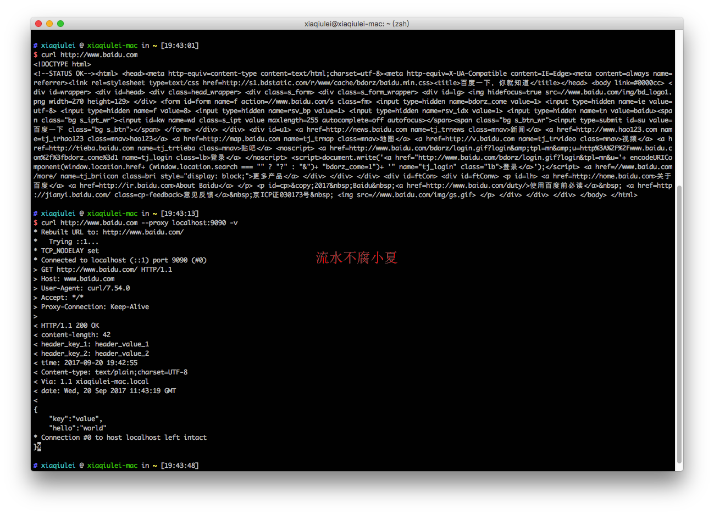

# MyMockServer

---

## 简介

在开发的时候，前端、移动端、后端开发分离，开发流程是先定义好接口API，然后按照接口约定进行开发。

所以经常需要根据接口Mock数据，有从代码层进行Mock，也有从网络层进行代理的。

本人使用方式是在网络代理进行Mock，因为在代码层Mock，数据不是很灵活，如果要改变数据，那么需要重新编译再启动（本人是移动开发），浪费不少时间。

在网络层Mock，使用的软件是Charles，然后对需要Mock的数据进行mapping就行了，可以是一个远程接口，也可以是一个本地文件。关于Charles使用，这里有一篇文章[介绍](http://blog.csdn.net/guijiaoba/article/details/43198503)。

上面的Mcok方式已经足够友好了，基本上可以满足90%的日常开发，但是还有些数据是不能满足的，比如服务器需要返回一个动态的时间戳，这个用刚刚的方式就不行。

所以很多开发者自己启动一个服务，然后返回对应的数据，这样也是可以的，但是有几个缺点。

* 自己启动服务，需要重新映射修改域名，同时对开发者要求也比较高，需要有服务器开发相关知识。

* 如果只想部分接口Mock数据，部分接口走真是数据，就需要修改代码或者做些配置，这样代码耦合性太高或者配置麻烦

于是世面出现了很多使用脚本实现一个代理服务器，对所有的接口进行过滤，添加一些白名单功能，对特定的接口返回特定的数据。常见的如阿里巴巴开源的anyproxy。

MyMockServer也是这样的，作为用代理服务器实现的Mock功能的服务器，以后简称mms，不过相对于使用脚本实现代理服务器，mms主要优势在于：

* 使用DSL配置，相对于json配置，最大优势，简单易懂，用户体验会更好

* 在DSL中可以使用Groovy语言修改相关逻辑处理，动态的返回数据

* 动态监听配置文件，修改文件后，立马生效，不需要重启服务，节省时间

# 安装

使用Mac HomeBrew安装

```bash
// add tap
brew tap LiushuiXiaoxia/mms

// brew install
brew install mms
```

其他平台直接下载压缩包即可，然后把压缩包中的bin目录添加到系统环境变量中，然后直接调用`MyMockServer`或者`MyMockServer.bat`。

## 使用

可以直接使用`mms`即可启动服务，`mms`支持参数如下。

```bash
$ mms -h
Path: /usr/local/bin/.
Cmd: mms -h
Log level : INFO
usage: mms [options]
 -c,--config <arg>   mock server path, default is current directory
 -h,--help           output usage information
 -i,--init           init some path as mock workspace
 -l,--level <arg>    log level ALL,DEBUG,INFO,WARN,ERROR,FATAL,OFF,TRACE
 -p,--port <arg>     mock server port, default is 9090
```

首先定义一个工作目录，默认情况下使用当前目录作为工作目录，工作目录用于保存配置文件。

```bash
$ mkdir proxy

$ cd proxy

$ mms -i
Path: /Users/xiaqiulei/proxy/.
Cmd: mms -i
Log level : INFO

$ ls
template.groovy
```

当然了也可以手动指定工作目录，这两种方式一样。

```bash
$ mkdir proxy

$ mms -i -c ./proxy
Path: /Users/xiaqiulei/test/.
Cmd: mms -i -c ./proxy
Log level : INFO

$ ls proxy
template.groovy
```

在工作目录中会自动生成模板文件`template.groovy`。

其实这个代理服务器使用的就是用Groovy实现的DSL功能。

```groovy
mock {
//    enable true
    desc "template"
    request {
//        scheme "http"
        host "www.google.com"
//        port 80
//        path "/api/login/"
        method "GET"
        params {
//            param "param_key_1", "param_value_1"
//            param "param_key_2", "param_value_2"
        }
        headers {
            header "header_key_1", "header_value_1"
            header "time", new Date().format("yyyy-MM-dd HH:mm:ss")
        }
        body {

        }
    }
    response {
//        version 'HTTP/1.1'
//        code 200
        headers {
            header "header_key_1", "header_value_1"
            header "time", new Date().format("yyyy-MM-dd HH:mm:ss")
        }
        body {
//            text "text"
//            textFile "file.txt"
//
            json """{"key":"value"}"""
//            jsonFile "file.txt"
//
//            xml "<xml/>"
//            xmlFile "file.txt"
//
//            html "<html/>"
//            htmlFile "file.txt"
//
//            file "file.txt"
        }
    }
//    control {
//        delay 3
//    }
}
```

做Android的同学，看到这个是不是眼熟，跟咱们的gradle是不是很像，没错，gradle也是一种DSL。

下面依次做讲解，mock下面主要分为4部分：描述，请求匹配、响应信息、控制部分。

### 描述

**enable**: 是否启用本条mock配置，默认是true，如果需要取消本次配置，可以设置为`enable false`

**desc**: 本次mock配置的描述信息

### 请求匹配

**scheme**: 请求scheme，如果指定某一种，则只匹配这种，如果不设置，则默认为`http`和`https`都匹配

**host**: 主机类型，如果设置，则匹配host，否则为null，则认为匹配成功

**port**: 请求端口，如果设置，则匹配端口，否则为80

**path**: 请求路径，如果设置，则匹配路径，否则为null，则认为匹配成功

**method**: 请求方法，如果设置，则匹配方法，否则为null，则认为匹配全部方法

**params**: 请求参数，如果设置，则匹配参数，否则为null，则认为匹配成功，暂时无用，保留

**headers**: 请求头部，如果设置，则匹配头部，否则为null，则认为匹配成功，暂时无用，保留

**body**: 请求实体，如果设置，则匹配实体，否则为null，则认为匹配成功，暂时无用，保留

简单来说，如果设置了，就严格匹配，不设置则认为匹配成功。

### 响应信息

同上面类似，只不过是返回的数据，如果request完全匹配，则返回response中的信息。

**version**: http版本协议，默认为'HTTP/1.1'

**code**: 响应状态吗，默认为200

**headers**: 所有的头部

**header**: 添加头部，一共2个参数，第一个为key，第二个为value

**body**: 响应body

**text**: 设置body为文本内容，参数为字符串类型

**textFile**: 设置body为文本文件内容，参数为文本文件对于的路径

**json**: 设置body为json，参数为json字符串

**jsonFile** 设置body为json文件中的内容，参数为json文件路径

**xml**: 设置body为xml，参数为xml字符串

**xmlFile** 设置body为ml文件中内容，参数为xml文件路径

**html**: 设置body为hml，参数为hml字符串

**htmlFile**: 设置body为hml文件中内容，参数为html文件路径

**file**: 设置body为一个文件的内容，参数为文件路径

因为配置文件使用的是Groovy，所以可以使用三个双引号来设置字符串，比如设置返回为json字符，json是是包含双引号的，如果按照Java中方式，那么就会出现转码，这样不方便阅读和修改。

那么可以这样设置，是不是很方便。


```gradle
json """
{
    "key":"value",
    "hello":"world"
}
"""
```

### 控制信息

**delay**: 设置响应时间，可以模拟入网环境，如果不设置，那么里面返回数据。


## 示例

比如我想Mock接口为`http://www.baidu.com`一条数据，那么首先启动mms服务。

```bash
$ mms
Path: /usr/local/bin/.
Cmd: mms
Log level : INFO

          _____                    _____                    _____
         /\    \                  /\    \                  /\    \
        /::\____\                /::\____\                /::\    \
       /::::|   |               /::::|   |               /::::\    \
      /:::::|   |              /:::::|   |              /::::::\    \
     /::::::|   |             /::::::|   |             /:::/\:::\    \
    /:::/|::|   |            /:::/|::|   |            /:::/__\:::\    \
   /:::/ |::|   |           /:::/ |::|   |            \:::\   \:::\    \
  /:::/  |::|___|______    /:::/  |::|___|______    ___\:::\   \:::\    \
 /:::/   |::::::::\    \  /:::/   |::::::::\    \  /\   \:::\   \:::\    \
/:::/    |:::::::::\____\/:::/    |:::::::::\____\/::\   \:::\   \:::\____\
\::/    / ~~~~~/:::/    /\::/    / ~~~~~/:::/    /\:::\   \:::\   \::/    /
 \/____/      /:::/    /  \/____/      /:::/    /  \:::\   \:::\   \/____/
             /:::/    /               /:::/    /    \:::\   \:::\    \
            /:::/    /               /:::/    /      \:::\   \:::\____\
           /:::/    /               /:::/    /        \:::\  /:::/    /
          /:::/    /               /:::/    /          \:::\/:::/    /
         /:::/    /               /:::/    /            \::::::/    /
        /:::/    /               /:::/    /              \::::/    /
        \::/    /                \::/    /                \::/    /
         \/____/                  \/____/                  \/____/

[2017-09-20 19:39:45 | INFO] >>>>>>>>>>>>>>>>>>>>>>>>>>>>>>>>>>>>>>>>>>>>>>>>>>>>>>>>>>>>>>>>>>>>>>>>>>>>>>>>>>>>>>>>
[2017-09-20 19:39:45 | INFO] Parse GET : [ [http/https]://www.google.com/[path]/ ] 		 /Users/xiaqiulei/test/proxy/./template.groovy -> template
[2017-09-20 19:39:45 | INFO] <<<<<<<<<<<<<<<<<<<<<<<<<<<<<<<<<<<<<<<<<<<<<<<<<<<<<<<<<<<<<<<<<<<<<<<<<<<<<<<<<<<<<<
[2017-09-20 19:39:45 | INFO] Starting proxy at address: 0.0.0.0/0.0.0.0:9090
[2017-09-20 19:39:45 | INFO] Proxy listening with TCP transport
[2017-09-20 19:39:46 | INFO] Proxy started at address: /0:0:0:0:0:0:0:0:9090
```

添加配置文件`baidu.groovy`，注意文件后缀必须是`.groovy`结尾。

```groovy
mock {
    desc "baidu"
    request {
        host "www.baidu.com"
    }
    response {
        code 200
        headers {
            header "header_key_1", "header_value_1"
            header "header_key_2", "header_value_2"
            header "time", new Date().format("yyyy-MM-dd HH:mm:ss")
        }
        body {
            json """{
    "key":"value",
    "hello":"world"
}"""
        }
    }
    control {
        delay 2
    }
}
```

过一会控制台就会出现文件修改的事件。

```bash
[2017-09-20 19:40:25 | INFO] >>>>>>>>>>>>>>>>>>>>>>>>>>>>>>>>>>>>>>>>>>>>>>>>>>>>>>>>>>>>>>>>>>>>>>>>>>>>>>>>>>>>>>>>
[2017-09-20 19:40:25 | INFO] Parse X : [ [http/https]://baidu.com/[path]/ ] 		 /Users/xiaqiulei/test/proxy/./baidu.groovy -> baidu
[2017-09-20 19:40:25 | INFO] Parse GET : [ [http/https]://www.google.com/[path]/ ] 		 /Users/xiaqiulei/test/proxy/./template.groovy -> template
[2017-09-20 19:40:25 | INFO] <<<<<<<<<<<<<<<<<<<<<<<<<<<<<<<<<<<<<<<<<<<<<<<<<<<<<<<<<<<<<<<<<<<<<<<<<<<<<<<<<<<<<<
```

然后我们用curl来验证下。

```bash
$ curl http://www.baidu.com

$ curl http://www.baidu.com --proxy localhost:9090 -v
```



很显然，两次请求返回的数据是不一样的，只不过第二次我们设置了代理，然后代理返回Mock的数据，同样，在移动端，可以设置的网络代理，然后就可以Mock App中的请求数据。

## 其他

* 本代理服务器暂时支持http，不支持https，后续会支持https。

* 第一个版本较为粗糙，如有其它意见，欢迎交流。